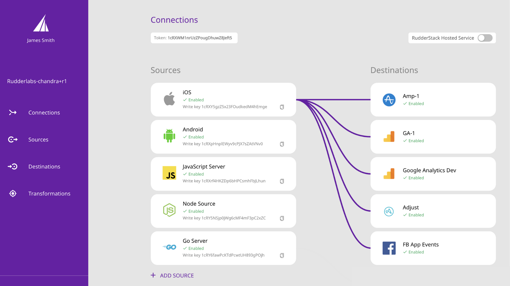

 

If you didn't already know, we're [big fans of open source](/blog/open-source-eating-saas).

As such, we're happy to announce an integration with yet another open source platform: [RudderStack](rudderstack.com).

RudderStack is an open-source, warehouse-first, customer data platform for developers. It allows you to collect and deliver customer event data to a variety of destinations such as data warehouses and analytics platforms.

The idea is that you can collect data from various sources and send it to one of their 70+ destinations with a single integration, making it easy to aggregate data from all services you use for data collection, as well as get the aggregated data into a data warehouse or sent to all the services where you need it to be. 

For example, you might collect analytics data from both your app and website, and then have the relevant events sent to PostHog, Slack, Salesforce, Snowflake, and S3. This way, all your teams have access to the data in the platform where they need it, you make sure you have all data stored in a warehouse, and do it all with only one integration as the intermediary.

In addition, just like PostHog, RudderStack can also be self-hosted, meaning you can deploy it in your own infrastructure, without having to send your data to a third-party. This makes PostHog and RudderStack a powerful combo, forming the foundation of a fully open-source and self-hosted enterprise analytics stack. 

To use this integration, check out our [dedicated docs page](/docs/integrations/rudderstack-integration) to get started.

Also, if you're already using RudderStack, you can connect to PostHog without having to move away from your current analytics stack, by simply adding us as a new destination in your pipeline. This is a great way to get started trying out PostHog without having to immediately commit to the change.

