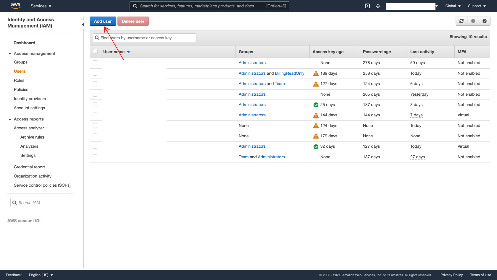
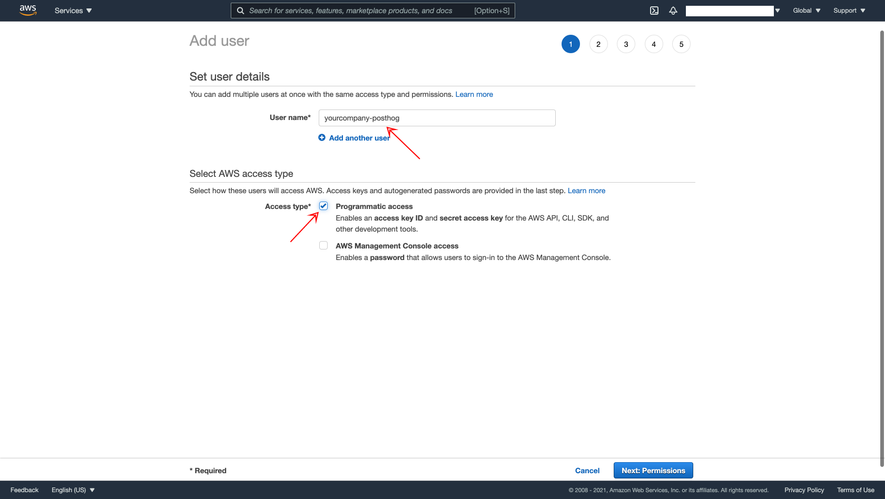
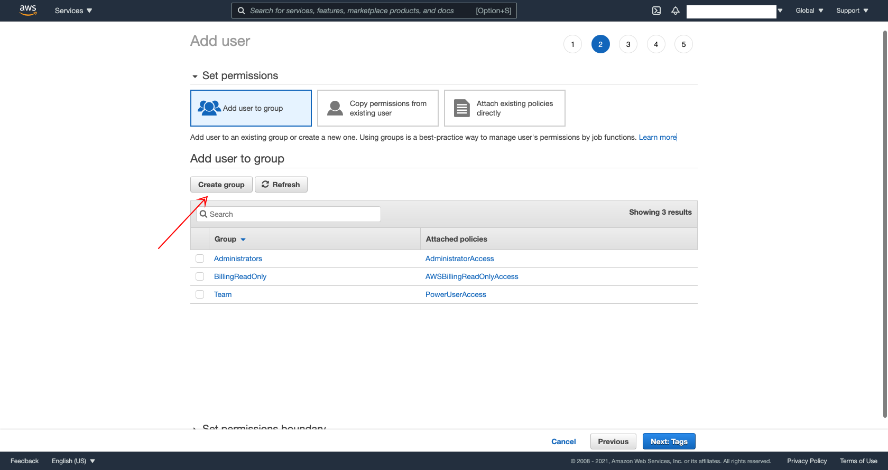

_[Click here for an overview of what a PostHog Virtual Private Cloud is](/docs/deployment/vpc/vpc)_

To get started with a Virtual Private Cloud on AWS, you'll need to give us access keys to an IAM user with the right permissions.

## 1. Go to IAM in your AWS console


## 2. Create a new IAM user

It makes sense to make it `companyname-posthog`.




## 3. Create a new permissions group

This way you'll be able to scope down what we have access to heavily.

The permissions we need are:
```json
{
    "Version": "2012-10-17",
    "Statement": [
        {
            "Sid": "PosthogDeploy",
            "Effect": "Allow",
            "Action": [
                "rds:*",
                "s3:*",
                "ec2:*",
                "elasticloadbalancing:*",
                "eks:*",
                "elasticache:*"
            ],
            "Resource": "*"
        }
    ]
}
```



## 4. Go through the rest of the process until you get to the access key

Make sure you copy the Access key ID and Secret access key immediately. We'll take it from here!

